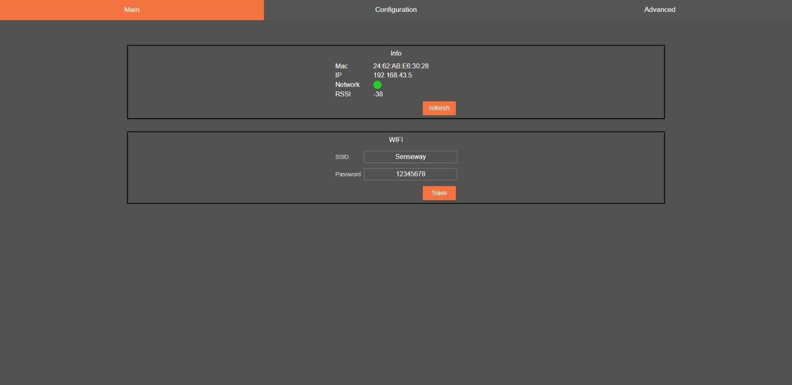
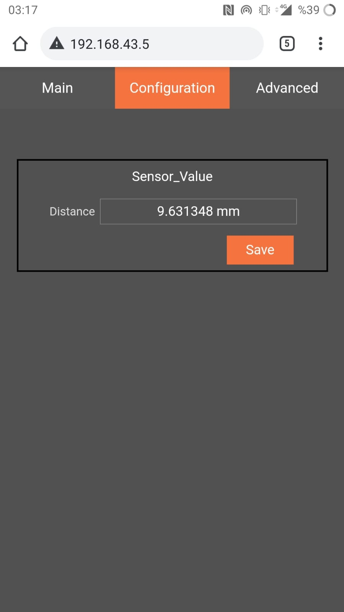

## [IotPitcher](https:www.iotpitcher.com) Example

Are you developing an IoT device with ESP32? 

You will save atleast a month of development. 

We don’t care about your cloud platform, IotPitcher is a sidekick for your application.

## [IotPitcher](https:www.iotpitcher.com) in a Nutshell

IotPitcher is an IoT development framework to build and configure easily with the following features :

- User friendly AP(Access Point) screen, so no need to know HTML, JavaScript or CSS!
- Easy setter and getter API for multiple overloaded functions to change and read any data easily
- Real time data output terminal, you can see your printed outputs without any extra work. You don't need to debug your devices with cable all the time!
- OTA (Over The Air) updates from your web browser (computer or mobile phone, any device with a web browser), just upload your application binary file!
- Info screen shows device MAC address, IP address in the network, connection status and RSSI value of the connected WiFi station. 
- Simple SSID and Password connection and change them any time with no code!
- If your project is C or C++ or you develop in Arduino IDE environment, it doesn't matter we provide optimized library for all!


## How to use

IotPitcher provides you prebuilded archive file as a library and one header file (`pitcher.h`), when you have the library 


To start easily, just include provided header file. It has everything what you need to talk with IotPitcher

```c++
#include "pitcher.h"
```

And start pitcher, its done!

```c++
pitcher_start();
```


## Linear Potentiometer Example developed in Arduino IDE

This project is provided as an example to show capabilites of IotPitcher. Configuration page contains only one data which is distance in this case.  Inside the loop data is set each second, and IotPitcher AP page shows its value real time!

```c++
#include <pitcher.h>

int sensorPin = 32;

void setup() {
    /*
        Pitcher needs to initialize its environment before everything, so this must be called before the program
    */
    pitcher_start();
}

char valueString[10];

void loop() {
  float distance= (analogRead(sensorPin)/4096.0)*25.0;
  sprintf(valueString,"%f mm",distance);
  pitcher_set_sensor_value_distance(valueString);
  delay(1000);
}
```


This is the main page of `IotPitcher`, it provides 




Configurations are created just for your project! With its simple API, you can read and write values directly from your code. If you want values can be changed from its AP page. 




For more info please visit [IotPitcher](https://iotpitcher.com/)

